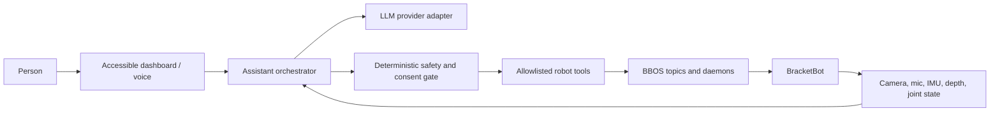

# BracketBot Baymax

A standalone, safety-first home for turning BracketBot into a warm, helpful
embodied assistant: expressive gestures, conversation, perception, navigation,
and carefully gated robot actions.

The project is inspired by Baymax's calm and approachable interaction style.
The goal is not to represent the robot as a medical professional. Any wellness
features must clearly communicate their limits and must never diagnose, treat,
or replace qualified care.

## What works today

- An accessible local dashboard with a typed allowlist of 15 primitive actions:
  five gestures, five light expressions, three sound cues, and two original
  instrumental music cues.
- Seven deterministic multi-step routines, including **welcome**,
  **double wave**, **calm moment**, and **dance party**, built from the same
  primitives future assistant plans will use.
- A stateful 4° **Lean / Balance** toggle with continuous BBOS refresh,
  upright gating, disconnect fallback, and explicit balance restoration.
- A local simulation mode that exercises dashboard actions, routines,
  cancellation, progress, and APIs without SSH or robot hardware.
- Automatic selection between the `botwifi` and USB `bot` SSH aliases.
- Robot-side safety checks before every gesture: upright check, bounded entry
  motion, live lift-height preservation, smooth entry and return, and torque
  off at completion.
- A prominent stop control; only one dashboard motion may run at a time.
- Existing BBOS applications for cameras, depth, IMU, audio, LEDs, navigation,
  Quest teleoperation, arm recording/playback, sound, and inference.
- A fully local vision prototype combining YOLO person detection, YuNet face
  localization, and smoothed EmotiEffLib visible-expression estimates.
- An existing Gemini-powered greeter and provider-ready inference code with
  OpenAI and Google client dependencies.
- Deterministic greeter voice commands for **wave**, **handshake**, **fist
  bump**, and **hug**, with non-action speech routed to OpenRouter when
  configured.

## Start the gesture dashboard

Requirements:

- Python 3.10 or newer on the control computer.
- An SSH alias named `botwifi` and/or `bot`, or the robot reachable as
  `bracketbot-184.local` over mDNS.
- BBOS installed on the robot at `~/bbos` with `uv` at `~/.local/bin/uv`.
- A person beside the physical e-stop whenever the robot moves.

Run:

```sh
python3 scripts/robot_dashboard.py
```

Open <http://127.0.0.1:8020>. The page is intentionally bound to localhost;
it should not be exposed to a network without authentication and transport
security.

The dashboard checks the configured Wi-Fi alias first, then automatically
tries the robot's mDNS hostname (`bracketbot-184.local`) so hotspot address
changes do not require editing SSH config, and finally falls back to USB.
Override the routes when necessary:

```sh
python3 scripts/robot_dashboard.py \
  --ssh-hosts botwifi,bracketbot@bracketbot-184.local,bot
```

On connection, the dashboard preloads its fixed runners and assets into the
robot's `/tmp` directory. Subsequent actions reuse an SSH control connection
and invoke the existing `~/bbos/.venv` directly (with `uv --no-sync` as a
fallback), avoiding a file upload and environment launch on every button
press. The status card reports measured runner-ready dispatch latency. Arm
gestures still retain their three-second safe entry and return ramps.

Develop or demo the full dashboard while the robot is offline:

```sh
python3 scripts/robot_dashboard.py --simulate
```

Simulation uses the real allowlist, API, sequencing state machine, progress,
and stop path, but never opens SSH or writes to BBOS.

Controls:

| Family | Actions | Keyboard |
| --- | --- | --- |
| Gestures | Wave, handshake, fist bump, hug, dance | `1`–`4`, `D` |
| Lights | Calm, ready, thinking, celebrate, off | `5`–`9` |
| Sounds | Processing, birthday, battery reminder | `P`, `B`, `L` |
| Music | Original calm and upbeat instrumentals | `M`, `U` |
| Routines | Welcome, thinking, celebrate, goodbye, double wave, calm moment, dance party | `W`, `T`, `C`, `G`, `V`, `K`, `X` |
| Base mode | Toggle 4° lean / balance | `Z` |
| Follow | Follow the person standing in front; distance slider | `F` |
| Cancellation | Stop the current action/routine safely | `Esc` |

The dashboard uploads only the selected allowlisted asset and its small runner
to `/tmp` on the active robot. It does not require this repository to be cloned
on the robot. `ActionSpec` is the common primitive schema, while `RoutineSpec`
stores ordered action IDs; no browser request or future model output can supply
an arbitrary command.

## Follow mode (person following)

**Follow me** (`F`) starts `scripts/robot_follow.py` on the robot. Stand
0.5–2 m in front of it: the only person-sized shape in that zone for half a
second is locked on. It finds you in the depth camera's 3D points alone (no
neural network), so it cannot tell you from a pillar or coat rack, and loses
you if you stand right against a wall or another person. The robot holds the
**Following distance** slider's gap (0.6–1.5 m, default 1.0 m, measured to the
front of your torso) to within ±20 cm while you stand, turn, or walk slowly.
The base is clamped to 0.3 m/s, so it cannot keep pace with normal walking and
catches up when you pause. It never drives backward, stops for anything in a
0.6 m corridor ahead, and stops by itself if the dashboard, the link, or
balance is lost. After losing you for 10 s it locks onto whoever next stands in
front of it. `Esc` stops it like every other action; `--simulate` exercises the
whole path without a robot.

Do not use follow mode around people until every robot gate in
`docs/superpowers/plans/2026-09-19-person-follow-depth-only.md` (Task 5) has
passed, with a person at the physical e-stop for each gate that moves the
robot. Until gate G4b passes, the speed cap is 0.15 m/s; `--follow-v-max 0.30`
and `--follow-rotate-only` exist for the gates. Design:
`docs/superpowers/specs/2026-09-19-person-follow-design.md`.

## Run local person and expression detection

Install the optional vision environment:

```sh
uv sync --extra vision
```

Start the laptop-camera prototype:

```sh
uv run --extra vision python people_detector.py
```

The preview draws green person boxes and a magenta box around the primary face
with a smoothed visible-expression label. Press **Q** or **Esc** to quit.

Useful variants:

```sh
# Person detection without expression analysis
uv run --extra vision python people_detector.py --no-expression

# Process a video and save an annotated copy
uv run --extra vision python people_detector.py \
  --source input.mp4 --output artifacts/annotated.mp4

# Apple Silicon acceleration (CPU is the most portable default)
uv run --extra vision python people_detector.py --device mps
```

The pipeline runs locally; camera frames are not sent to an API. Its expression
label describes visible facial appearance, **not** a person's internal emotion,
intent, mental state, or health. Predictions can be wrong because of lighting,
occlusion, pose, disability, culture, or ordinary individual variation. Do not
use this signal for diagnosis, access control, risk scoring, or autonomous
decisions about a person. A future assistant may use it only as a low-confidence
conversation cue and should ask rather than assume how someone feels.

The repository includes the small model files needed for deterministic offline
startup. Their sources and checksums are documented in
[`assets/models/README.md`](assets/models/README.md). The YOLO checkpoint is an
Ultralytics YOLO11 pose model; review upstream Ultralytics licensing before
redistributing or using it commercially.

The checkpoint loads, infers, exports to ONNX opset 17, and runs through ONNX
Runtime locally. The robot was offline during the compatibility pass, so its
specific Jetson runtime is not claimed as verified. See
[`docs/yolo-robot-port.md`](docs/yolo-robot-port.md) for the evidence, expected
TensorRT path, and exact live-robot gate to run after reconnecting.

## Safety model

Robot motion is treated as a privileged tool, not as unrestricted model
output. An LLM must never write directly to `arm_*.ctrl`, `arm_*.torque`,
`drive.ctrl`, or `base.mode`.

Every physical action should follow this flow:

1. The assistant proposes a named, allowlisted action.
2. Deterministic code validates context, robot state, limits, and conflicts.
3. The action runner owns the relevant BBOS writer for the shortest practical
   time.
4. Stop, disconnect, error, and normal completion all converge on a safe
   return and torque-off path.
5. Higher-risk actions require explicit human confirmation and an operator at
   the e-stop.

Current gesture protections include:

- dry-run by default in the robot-side runner;
- IMU roll/pitch gating;
- automatic active-arm detection so unused arms remain untouched;
- current lift-height preservation;
- a maximum entry-distance check;
- smooth three-second entry and return paths;
- `SIGINT`, `SIGTERM`, and SSH-disconnect handling;
- single-motion locking in the dashboard.

Lean mode is held by its own single BBOS writer because the request expires
after roughly 0.25 seconds. The runner verifies the IMU first, republishes at
20 Hz, restores balance on normal stop/signals, and relies on BBOS request
expiry as a final disconnect fallback. The global Stop control cancels the
current action and returns the base to balance.

Recordings are robot-specific motor-turn trajectories. Validate any new or
edited recording on the intended robot with a dry run before enabling motion.

## Architecture



The dashboard currently talks to the safe gesture runner over SSH. The target
architecture moves intent handling into an assistant orchestrator while
keeping physical safeguards outside the model boundary.

## LLM integration direction

The next layer should expose a small provider-neutral interface so OpenAI,
Gemini, or an on-device model can be selected through configuration. Suggested
capabilities:

- streaming speech-to-speech conversation;
- camera descriptions with explicit consent and visible capture state;
- user preferences stored locally with clear inspect/delete controls;
- tool calls for gestures, sounds, LEDs, navigation, and approved routines;
- interruption handling so speech and motion stop promptly;
- a calm persona prompt that is friendly without making medical claims;
- audit logs containing tool decisions but no raw audio/video by default.

Keep provider secrets out of source control. Copy `.env.example` to `.env` on
the machine that runs the relevant app:

```sh
cp .env.example .env
```

The existing `bbapps/greeter/main.py` uses `GEMINI_API_KEY`. The inference
folder already contains Google and OpenAI client dependencies and is the best
reference for future provider adapters.

### Voice commands and OpenRouter

The greeter uses Gemini Live for its existing microphone/speaker transport and
finalized speech transcription. Every spoken human turn is verified against
that transcript and passed to `bbapps/greeter/voice_router.py` before anything
happens; a model-authored tool argument cannot independently authorize motion:

1. An exact, normalized phrase from the local allowlist starts one installed
   gesture. Examples include “Baymax, give me a hug”, “Baymax, fist bump me”,
   “shake my hand”, and “wave at me”. Only one movement can run at a time.
2. Questions and other conversation are sent as text to OpenRouter. The LLM
   never receives a robot-action tool and cannot create a motion.
3. Similar but unapproved text, such as “tell me about fist bumps”, cannot
   trigger a gesture. Add new voice authority deliberately in
   `ACTION_ALIASES`, not in an LLM prompt.

Configure both parts in `.env` on the robot:

```sh
GEMINI_API_KEY=...
OPENROUTER_API_KEY=...
OPENROUTER_MODEL=openai/gpt-oss-20b
```

Then run the existing app as usual:

```sh
cd bbapps/greeter
uv run main.py
```

`OPENROUTER_MODEL` is optional and defaults to `openai/gpt-oss-20b`, which is
well suited to the assistant's short, simple spoken queries. Without an
OpenRouter key, allowlisted gestures still work and questions receive a short
configuration message. Run all gesture tests in simulation/dry-run first and
keep a person beside the physical e-stop when voice motion is enabled.

## Repository layout

| Path | Purpose |
| --- | --- |
| `scripts/robot_dashboard.py` | Local accessible dashboard and SSH discovery |
| `scripts/gesture_test.py` | Generic safe robot-side gesture runner |
| `scripts/robot_effect.py` | Bounded, cancellable robot-side sound/LED runner |
| `scripts/robot_base_mode.py` | Bounded 4° lean hold with balance restoration |
| `scripts/generate_music_assets.py` | Deterministically regenerates original PCM music cues |
| `scripts/check_yolo_runtime.py` | Camera-free YOLO runtime compatibility smoke test |
| `scripts/handshake_test.py` | Focused standalone handshake runner |
| `scripts/wave_test.py` | Focused standalone wave runner |
| `people_detector.py` | Local YOLO + YuNet + visible-expression pipeline |
| `assets/models/` | Documented YuNet and EmotiEffLib ONNX assets |
| `tests/test_people_detector.py` | Unit tests for detection conversion and smoothing |
| `bbapps/greeter/` | YOLO/Gemini greeter and gesture recordings |
| `bbapps/inference/` | Policy and VLM clients, adapters, and task manifest |
| `bbapps/nav/` | Navigation and relocalization tools |
| `bbapps/quest_teleop/` | Quest arm teleoperation and safe homing |
| `bbapps/examples/` | Small BBOS camera, depth, arm, audio, LED, and IMU examples |
| `bbapps/play_sound/` | Speaker playback and soundboard |
| `docs/bracketbot-bbos-dictionary.md` | BBOS topic and API field guide |
| `docs/robot-facts.md` | Measurements and findings from the physical robot |
| `docs/dashboard-action-roadmap.md` | Action-family inventory and safe sequencing roadmap |
| `docs/yolo-robot-port.md` | YOLO compatibility evidence and Jetson port gate |

Most robot apps target Python 3.10 and declare their robot-only dependencies
in inline `uv` metadata or their local `pyproject.toml`. The local dashboard
uses only the Python standard library.

## Direct gesture checks

The generic runner is dry-run first:

```sh
scp scripts/gesture_test.py \
  bbapps/greeter/movements/handshake.json botwifi:/tmp/
ssh botwifi 'export PATH="$HOME/.local/bin:$PATH"; \
  uv run --no-sync --project "$HOME/bbos" python /tmp/gesture_test.py \
  /tmp/handshake.json --name Handshake'
```

Only after reviewing the printed IMU and entry checks, add `--execute`. The
dashboard performs the same checks and supplies `--execute` after a deliberate
button or keyboard action.

## Development checks

```sh
python3 -m py_compile scripts/robot_dashboard.py scripts/gesture_test.py \
  scripts/robot_effect.py scripts/robot_base_mode.py \
  scripts/check_yolo_runtime.py people_detector.py
uv run --extra vision --extra dev pytest
uv run --extra vision python scripts/check_yolo_runtime.py
git diff --check
```

Run robot-facing commands only with the workspace clear and a person at the
e-stop. Simulator and model-training work should remain isolated from the
production robot action path.

## Roadmap

- [x] Separate deterministic voice actions from an OpenRouter conversation adapter.
- [ ] Add speech interruption and turn-taking tests.
- [ ] Add authenticated remote access instead of exposing the local dashboard.
- [ ] Add consent-aware vision and local retention controls.
- [ ] Feed the local vision result into the assistant as an optional,
      uncertainty-labelled observation instead of an automatic trigger.
- [x] Wrap gestures, sound, LED, and approved routines as typed dashboard actions.
- [ ] Add navigation only after bounded-distance controls and obstacle/stop gates are proven on the robot.
- [ ] Add action-policy tests proving models cannot bypass the safety gate.
- [ ] Add health/status telemetry without medical diagnosis claims.
- [ ] Package deployment and service management for the Jetson.

## License

MIT. See [LICENSE](LICENSE).
