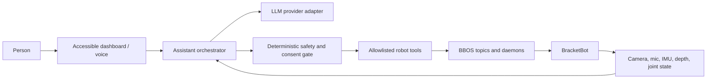

# BracketBot Baymax

A standalone, safety-first home for turning BracketBot into a warm, helpful
embodied assistant: expressive gestures, conversation, perception, navigation,
and carefully gated robot actions.

The project is inspired by Baymax's calm and approachable interaction style.
The goal is not to represent the robot as a medical professional. Any wellness
features must clearly communicate their limits and must never diagnose, treat,
or replace qualified care.

## What works today

- An accessible local dashboard for **wave**, **handshake**, **fist bump**, and
  **hug**.
- Automatic selection between the `botwifi` and USB `bot` SSH aliases.
- Robot-side safety checks before every gesture: upright check, bounded entry
  motion, live lift-height preservation, smooth entry and return, and torque
  off at completion.
- A prominent stop control; only one dashboard motion may run at a time.
- Existing BBOS applications for cameras, depth, IMU, audio, LEDs, navigation,
  Quest teleoperation, arm recording/playback, sound, and inference.
- An existing Gemini-powered greeter and provider-ready inference code with
  OpenAI and Google client dependencies.

## Start the gesture dashboard

Requirements:

- Python 3.10 or newer on the control computer.
- SSH aliases named `botwifi` and/or `bot`.
- BBOS installed on the robot at `~/bbos` with `uv` at `~/.local/bin/uv`.
- A person beside the physical e-stop whenever the robot moves.

Run:

```sh
python3 scripts/robot_dashboard.py
```

Open <http://127.0.0.1:8020>. The page is intentionally bound to localhost;
it should not be exposed to a network without authentication and transport
security.

The dashboard checks both SSH routes and chooses the first reachable one in
the configured order. Override the aliases when necessary:

```sh
python3 scripts/robot_dashboard.py --ssh-hosts botwifi,bot
```

Controls:

| Action | Button | Keyboard |
| --- | --- | --- |
| Wave | Wave | `1` |
| Handshake | Handshake | `2` |
| Fist bump | Fist bump | `3` |
| Hug | Hug | `4` |
| Return safely and stop | Stop motion | `Esc` |

The dashboard uploads the selected recording and `gesture_test.py` to `/tmp`
on the active robot. It does not require this repository to be cloned on the
robot.

## Safety model

Robot motion is treated as a privileged tool, not as unrestricted model
output. An LLM must never write directly to `arm_*.ctrl`, `arm_*.torque`,
`drive.ctrl`, or `base.mode`.

Every physical action should follow this flow:

1. The assistant proposes a named, allowlisted action.
2. Deterministic code validates context, robot state, limits, and conflicts.
3. The action runner owns the relevant BBOS writer for the shortest practical
   time.
4. Stop, disconnect, error, and normal completion all converge on a safe
   return and torque-off path.
5. Higher-risk actions require explicit human confirmation and an operator at
   the e-stop.

Current gesture protections include:

- dry-run by default in the robot-side runner;
- IMU roll/pitch gating;
- automatic active-arm detection so unused arms remain untouched;
- current lift-height preservation;
- a maximum entry-distance check;
- smooth three-second entry and return paths;
- `SIGINT`, `SIGTERM`, and SSH-disconnect handling;
- single-motion locking in the dashboard.

Recordings are robot-specific motor-turn trajectories. Validate any new or
edited recording on the intended robot with a dry run before enabling motion.

## Architecture



The dashboard currently talks to the safe gesture runner over SSH. The target
architecture moves intent handling into an assistant orchestrator while
keeping physical safeguards outside the model boundary.

## LLM integration direction

The next layer should expose a small provider-neutral interface so OpenAI,
Gemini, or an on-device model can be selected through configuration. Suggested
capabilities:

- streaming speech-to-speech conversation;
- camera descriptions with explicit consent and visible capture state;
- user preferences stored locally with clear inspect/delete controls;
- tool calls for gestures, sounds, LEDs, navigation, and approved routines;
- interruption handling so speech and motion stop promptly;
- a calm persona prompt that is friendly without making medical claims;
- audit logs containing tool decisions but no raw audio/video by default.

Keep provider secrets out of source control. Copy `.env.example` to `.env` on
the machine that runs the relevant app:

```sh
cp .env.example .env
```

The existing `bbapps/greeter/main.py` uses `GEMINI_API_KEY`. The inference
folder already contains Google and OpenAI client dependencies and is the best
reference for future provider adapters.

## Repository layout

| Path | Purpose |
| --- | --- |
| `scripts/robot_dashboard.py` | Local accessible dashboard and SSH discovery |
| `scripts/gesture_test.py` | Generic safe robot-side gesture runner |
| `scripts/handshake_test.py` | Focused standalone handshake runner |
| `scripts/wave_test.py` | Focused standalone wave runner |
| `bbapps/greeter/` | YOLO/Gemini greeter and gesture recordings |
| `bbapps/inference/` | Policy and VLM clients, adapters, and task manifest |
| `bbapps/nav/` | Navigation and relocalization tools |
| `bbapps/quest_teleop/` | Quest arm teleoperation and safe homing |
| `bbapps/examples/` | Small BBOS camera, depth, arm, audio, LED, and IMU examples |
| `bbapps/play_sound/` | Speaker playback and soundboard |
| `docs/bracketbot-bbos-dictionary.md` | BBOS topic and API field guide |
| `docs/robot-facts.md` | Measurements and findings from the physical robot |

Most robot apps target Python 3.10 and declare their robot-only dependencies
in inline `uv` metadata or their local `pyproject.toml`. The local dashboard
uses only the Python standard library.

## Direct gesture checks

The generic runner is dry-run first:

```sh
scp scripts/gesture_test.py \
  bbapps/greeter/movements/handshake.json botwifi:/tmp/
ssh botwifi 'export PATH="$HOME/.local/bin:$PATH"; \
  uv run --no-sync --project "$HOME/bbos" python /tmp/gesture_test.py \
  /tmp/handshake.json --name Handshake'
```

Only after reviewing the printed IMU and entry checks, add `--execute`. The
dashboard performs the same checks and supplies `--execute` after a deliberate
button or keyboard action.

## Development checks

```sh
python3 -m py_compile scripts/robot_dashboard.py scripts/gesture_test.py
git diff --check
```

Run robot-facing commands only with the workspace clear and a person at the
e-stop. Simulator and model-training work should remain isolated from the
production robot action path.

## Roadmap

- [ ] Extract a provider-neutral conversation and tool-calling interface.
- [ ] Add speech interruption and turn-taking tests.
- [ ] Add authenticated remote access instead of exposing the local dashboard.
- [ ] Add consent-aware vision and local retention controls.
- [ ] Wrap sound, LED, navigation, and approved routines as typed tools.
- [ ] Add action-policy tests proving models cannot bypass the safety gate.
- [ ] Add health/status telemetry without medical diagnosis claims.
- [ ] Package deployment and service management for the Jetson.

## License

MIT. See [LICENSE](LICENSE).
