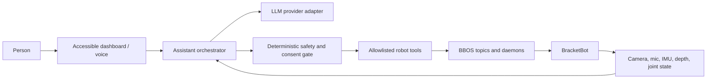

# BracketBot Baymax

A standalone, safety-first home for turning BracketBot into a warm, helpful
embodied assistant: expressive gestures, conversation, perception, navigation,
and carefully gated robot actions.

The project is inspired by Baymax's calm and approachable interaction style.
The goal is not to represent the robot as a medical professional. Any wellness
features must clearly communicate their limits and must never diagnose, treat,
or replace qualified care.

## What works today

For person-follow setup after pulling, start with [Follow readiness](docs/follow-readiness.md).
Motion requires a calibration file on the specific robot; laptop tests do not
replace the physical follow tests.

- An accessible local dashboard with a typed allowlist of 23 primitive actions:
  eight gestures, adaptive two-arm table positioning, five light expressions,
  three sound cues, two original instrumental music cues, and four
  pre-rendered spoken lines.
- Nine deterministic multi-step routines, including **welcome**,
  **introduce Baymax**, **calm moment**, **dance party**, and **sign off**,
  built from the same primitives future assistant plans will use.
- A stateful 4° **Lean / Balance** toggle with continuous BBOS refresh,
  upright gating, disconnect fallback, and explicit balance restoration.
- **Place arms on table** uses fresh depth points to detect a broad reachable
  tabletop and validates both hand locations and the complete IK path. After
  measured arrival it releases torque and controller ownership, leaving the
  arms supported on the table so another gesture can start there and return to
  that same live pose. Stop during the approach still returns the arms along
  the checked path.
  Its Technical details log includes camera-to-arm frame conversion, point and
  surface counts, rejection gates, per-hand support, IK waypoints, calibration
  bounds, motion progress, measured arrival, and cleanup. For perception-only
  diagnosis on the robot, run `python /tmp/table_rest.py --scan-only`; this
  opens no arm writers. Use `--plan-only` to also validate live arm-state IK
  paths and calibration bounds without opening control/torque writers.
- A local simulation mode that exercises dashboard actions, routines,
  cancellation, progress, and APIs without SSH or robot hardware.
- Automatic selection between the `botwifi` and USB `bot` SSH aliases.
- Robot-side safety checks before every gesture: upright check, bounded entry
  motion, live lift-height preservation, smooth entry and return, and torque
  off at completion.
- A prominent stop control; only one dashboard motion may run at a time.
- Existing BBOS applications for cameras, depth, IMU, audio, LEDs, navigation,
  Quest teleoperation, arm recording/playback, sound, and inference.
- A fully local vision prototype combining YOLO person detection, YuNet face
  localization, and smoothed EmotiEffLib visible-expression estimates.
- A depth-grounded **possible person on ground** prototype that aligns YOLO pose
  joints with `camera.points`, places the observation in the live SLAM map, and
  cancels autonomous navigation through a deterministic interlock. Physical
  posture calibration is still required before treating it as a safety system.
- A local contactless heart-rate (rPPG) signal chain with a laptop concept
  check and a read-only head-camera app for the robot, gated on a camera
  check and explicitly **not** a medical measurement.
- An existing Gemini-powered greeter and provider-ready inference code with
  OpenAI and Google client dependencies.
- Deterministic greeter voice commands for **wave**, **salute**, **handshake**,
  **fist bump**, **hug**, **namaste**, pointing, dance, and safe **stop**, with
  non-action speech routed to OpenRouter when configured. The lightweight local
  assistant also exposes the existing light, sound, music, and routine catalog.

## Start the gesture dashboard

Requirements:

- Python 3.10 or newer on the control computer.
- An SSH alias named `botwifi` and/or `bot`, or the robot reachable as
  `bracketbot-184.local` over mDNS.
- BBOS installed on the robot at `~/bbos` with `uv` at `~/.local/bin/uv`.
- The robot depth daemon publishing `camera.points` for adaptive table placement.
- A person beside the physical e-stop whenever the robot moves.

Run:

```sh
python3 scripts/robot_dashboard.py
```

Open <http://127.0.0.1:8020>. The page is intentionally bound to localhost;
it should not be exposed to a network without authentication and transport
security.

Dashboard hot reload is enabled by default. Saving
`scripts/robot_dashboard.py` restarts the server once robot actions and lean
mode are safely idle, and an already-open page reloads itself. Pass
`--no-reload` only when automatic development reloads are undesirable.

The dashboard checks the configured Wi-Fi alias first, then automatically
tries the robot's mDNS hostname (`bracketbot-184.local`) so hotspot address
changes do not require editing SSH config, and finally falls back to USB.
Override the routes when necessary:

```sh
python3 scripts/robot_dashboard.py \
  --ssh-hosts botwifi,bracketbot@bracketbot-184.local,bot
```

On connection, the dashboard preloads its fixed runners and assets into the
robot's `/tmp` directory. Subsequent actions reuse an SSH control connection
and invoke the existing `~/bbos/.venv` directly (with `uv --no-sync` as a
fallback), avoiding a file upload and environment launch on every button
press. The status card reports measured runner-ready dispatch latency. Arm
gestures still retain their three-second safe entry and return ramps.

Develop or demo the full dashboard while the robot is offline:

```sh
python3 scripts/robot_dashboard.py --simulate
```

Simulation uses the real allowlist, API, sequencing state machine, progress,
and stop path, but never opens SSH or writes to BBOS.

### Run the orchestrated judge demo

The dashboard includes a guided **first-minute demo** with a shared clock and
presenter cue cards, followed by the existing three-part robot sequence:
welcome, background packing with conversation and non-arm expressions still
available, then a finale that waits for the packing process to release the
robot. Rehearse the whole flow in simulation, or connect a safe packing wrapper
with `--demo-pack-command`. Operator cues, the packing-process contract, and
failure behavior are in
[`docs/judge-demo.md`](docs/judge-demo.md).

Controls:

| Family | Actions | Keyboard |
| --- | --- | --- |
| Gestures | Wave, handshake, fist bump, hug, namaste, salute, point at person, dance | `1`–`4`, `N`, `S`, `O`, `D` |
| Lights | Calm, ready, thinking, celebrate, off | `5`–`9` |
| Sounds | Processing, birthday, battery reminder | `P`, `B`, `L` |
| Music | Original calm and upbeat instrumentals | `M`, `U` |
| Lines | Introduce yourself, what I can do, comfort, farewell | `I`, `A`, `E`, `Y` |
| Routines | Welcome, thinking, celebrate, goodbye, double wave, calm moment, dance party, introduce Baymax, sign off | `W`, `T`, `C`, `G`, `V`, `K`, `X`, `H`, `J` |
| Base mode | Toggle 4° lean / balance | `Z` |
| Positioning | Detect table and place both arms | `R` |
| Follow | Follow the person standing in front; distance slider | `F` |
| Cancellation | Stop the current action/routine safely | `Esc` |

The dashboard uploads only the selected allowlisted asset and its small runner
to `/tmp` on the active robot. It does not require this repository to be cloned
on the robot. `ActionSpec` is the common primitive schema, while `RoutineSpec`
stores ordered action IDs; no browser request or future model output can supply
an arbitrary command.

## Pre-rendered spoken lines

The **Lines** family is the handful of sentences BracketBot says the same way
every time: its self-introduction, a short tour of what it can really do, an
offer of company, and a farewell. Each one is written in
[`scripts/canned_lines.py`](scripts/canned_lines.py), rendered once to a
speaker-ready WAV in `assets/lines/`, and played through the ordinary
allowlisted sound path.

That means a scripted sentence costs one WAV playback instead of a wake word, a
transcription, a model round trip, and live speech synthesis — and it still
works with no network, no OpenRouter key, and no microphone. A line declares
only the `speaker` channel, so it can never move the robot, and it remains
available while a manipulation policy owns the arms.

Render or re-render them on a machine with the macOS speech engine:

```sh
python3 scripts/generate_line_assets.py
python3 scripts/generate_line_assets.py --force --voice "Reed (English (US))"
```

The renderer records each line's exact text, voice, rate, pitch, sample rate,
and checksum in `assets/lines/manifest.json`, and a test fails if a line's text
is edited without re-rendering its audio. Lines are rendered at the robot
speaker's mono 16 kHz format because `robot_effect.py` refuses anything else.
Until a line is rendered, its dashboard button safely rejects with the command
to run. The same audio is written into the TTS bridge's cache, so a live spoken
reply with identical text is free too.

**Introduce Baymax** (`H`) and **Sign off** (`J`) are the two routines built
from these lines: a light, the spoken line, then a wave.

## Follow mode (person following)

**Follow me** (`F`) starts `scripts/robot_follow.py` on the robot. Stand
0.5–2 m in front of it: the only person-sized shape in that zone for half a
second is locked on. It finds you in the depth camera's 3D points alone (no
neural network), so it cannot tell you from a pillar or coat rack, and loses
you if you stand right against a wall or another person. The robot holds the
**Following distance** slider's gap (0.6–1.5 m, default 1.0 m, measured to the
front of your torso) to within ±20 cm while you stand, turn, or walk slowly.
The base is clamped to 0.3 m/s, so it cannot keep pace with normal walking and
catches up when you pause. It never drives backward, stops for anything in a
0.6 m corridor ahead, and stops by itself if the dashboard, the link, or
balance is lost. After losing you for 10 s it locks onto whoever next stands in
front of it. `Esc` stops it like every other action; `--simulate` exercises the
dashboard, API, and UI path without a robot (the simulated runner is a scripted
status generator, not `follow_core`).

Do not use follow mode around people until every robot gate in
`docs/superpowers/plans/2026-09-19-person-follow-depth-only.md` (Task 5) has
passed, with a person at the physical e-stop for each gate that moves the
robot. Until gate G4b passes, the speed cap is 0.15 m/s; `--follow-v-max 0.30`
and `--follow-rotate-only` exist for the gates. Design:
`docs/superpowers/specs/2026-09-19-person-follow-design.md`.

## Run local person and expression detection

Install the optional vision environment:

```sh
uv sync --extra vision
```

Start the laptop-camera prototype:

```sh
uv run --extra vision python people_detector.py
```

The preview draws green person boxes and a magenta box around the primary face
with a smoothed visible-expression label. If a confidently sad-looking
expression persists for 1.5 seconds, the computer asks, “Hey, you look a little
sad. Are you okay?” through the system text-to-speech voice. The cue must clear
before it can fire again and has a 30-second cooldown. Press **Q** or **Esc** to
quit.

Useful variants:

```sh
# Person detection without expression analysis
uv run --extra vision python people_detector.py --no-expression

# Process a video and save an annotated copy
uv run --extra vision python people_detector.py \
  --source input.mp4 --output artifacts/annotated.mp4

# Apple Silicon acceleration (CPU is the most portable default)
uv run --extra vision python people_detector.py --device mps

# Change the prompt or disable speech
uv run --extra vision python people_detector.py \
  --sad-voice-text "Hey, how are you feeling?"
uv run --extra vision python people_detector.py --no-sad-voice
```

The pipeline runs locally; camera frames are not sent to an API. Its expression
label describes visible facial appearance, **not** a person's internal emotion,
intent, mental state, or health. Predictions can be wrong because of lighting,
occlusion, pose, disability, culture, or ordinary individual variation. Do not
use this signal for diagnosis, access control, risk scoring, or autonomous
decisions about a person. A future assistant may use it only as a low-confidence
conversation cue and should ask rather than assume how someone feels.

### Run the same pipeline on the robot

[`bbapps/emotion_greeter`](bbapps/emotion_greeter) reads the left eye directly
from the robot's `camera.head.rgb` BBOS topic, runs an OpenCV-compatible YOLO11
export plus the same YuNet and expression models, and sends its local voice
prompt to `speaker.audio`. It does not need Gemini or another cloud service.
Its port 8018 dashboard shows the annotated robot view, temporary person
tracking IDs, expression confidence, processing time, camera-frame age, and
scan rate. See the app README for model export, deployment, smoke-test, and
autostart instructions.

The repository includes the small model files needed for deterministic offline
startup. Their sources and checksums are documented in
[`assets/models/README.md`](assets/models/README.md). The YOLO checkpoint is an
Ultralytics YOLO11 pose model; review upstream Ultralytics licensing before
redistributing or using it commercially.

The checkpoint loads, infers, exports to ONNX opset 17, and runs through ONNX
Runtime locally. The robot was offline during the compatibility pass, so its
specific Jetson runtime is not claimed as verified. See
[`docs/yolo-robot-port.md`](docs/yolo-robot-port.md) for the evidence, expected
TensorRT path, and exact live-robot gate to run after reconnecting.

## Safety model

Robot motion is treated as a privileged tool, not as unrestricted model
output. An LLM must never write directly to `arm_*.ctrl`, `arm_*.torque`,
`drive.ctrl`, or `base.mode`.

Every physical action should follow this flow:

1. The assistant proposes a named, allowlisted action.
2. Deterministic code validates context, robot state, limits, and conflicts.
3. The action runner owns the relevant BBOS writer for the shortest practical
   time.
4. Stop, disconnect, error, and normal completion all converge on a safe
   return and torque-off path.
5. Higher-risk actions require explicit human confirmation and an operator at
   the e-stop.

Current gesture protections include:

- dry-run by default in the robot-side runner;
- IMU roll/pitch gating;
- automatic active-arm detection so unused arms remain untouched;
- current lift-height preservation;
- a maximum entry-distance check;
- a fresh depth-cloud clearance check around each active arm before voice
  gestures open motor writers;
- smooth three-second entry and return paths;
- `SIGINT`, `SIGTERM`, and SSH-disconnect handling;
- single-motion locking in the dashboard.

Lean mode is held by its own single BBOS writer because the request expires
after roughly 0.25 seconds. The runner verifies the IMU first, republishes at
20 Hz, restores balance on normal stop/signals, and relies on BBOS request
expiry as a final disconnect fallback. The global Stop control cancels the
current action and returns the base to balance.

Recordings are robot-specific motor-turn trajectories. Validate any new or
edited recording on the intended robot with a dry run before enabling motion.

## Architecture



The dashboard currently talks to the safe gesture runner over SSH. The target
architecture moves intent handling into an assistant orchestrator while
keeping physical safeguards outside the model boundary.

## LLM integration direction

The next layer should expose a small provider-neutral interface so OpenAI,
Gemini, or an on-device model can be selected through configuration. Suggested
capabilities:

- streaming speech-to-speech conversation;
- camera descriptions with explicit consent and visible capture state;
- user preferences stored locally with clear inspect/delete controls;
- tool calls for gestures, sounds, LEDs, navigation, and approved routines;
- interruption handling so speech and motion stop promptly;
- a calm persona prompt that is friendly without making medical claims;
- audit logs containing tool decisions but no raw audio/video by default.

Keep provider secrets out of source control. Copy `.env.example` to `.env` on
the machine that runs the relevant app:

```sh
cp .env.example .env
```

The greeter defaults to local `whisper.cpp` transcription and `espeak-ng`
speech when `GEMINI_API_KEY` is absent. Gemini Live remains an optional voice
transport, not a requirement for GPT-OSS or Browserbase.

### Voice commands and OpenRouter

The greeter uses local Whisper by default, with Gemini Live available as an
optional microphone/speaker transport. Every spoken human turn is bound to its
finalized transcript and passed to `bbapps/greeter/voice_router.py`; a
model-authored tool argument cannot independently authorize motion:

1. An exact, normalized phrase from the local allowlist starts one installed
   gesture without depending on network availability. Examples include
   “Baymax, give me a hug”, “give me a salute”, “wave at me”, “BracketBot,
   bye” (wave, then disable torque on both arms), “BracketBot, namaste”,
   “BracketBot, dance”, and “point at a person”. “Hey BracketBot, stop”
   bypasses the model and safely cancels the active voice action.
2. For a natural but still explicit request such as “Could you do a friendly
   wave hello?”, GPT-OSS can call the typed `perform_gesture` tool. The tool
   only accepts named allowlisted gestures, re-checks the finalized transcript,
   and rejects discussion, negation, mismatched names, or multiple motions.
3. The same deterministic executor handles both paths. It permits only one
   movement at a time and checks fresh IMU, arm positions, bounded entry motion,
   and depth points in a conservative active-arm clearance volume before any
   gesture writer is opened. Missing depth fails closed. The real started or
   rejected result is sent back to the LLM before it speaks.

   How much padding that clearance volume keeps is tunable with
   `BAYMAX_GESTURE_RISK` (`cautious`, `balanced` (default), `bold`). The profile
   only shrinks *soft* margins around the recorded hand path, where a separate
   hard collision gate still backstops the decision. The upright check and the
   hard collision radius are hazards rather than caution and no profile can
   reach them, so a bolder setting buys willingness to act, not contact.
4. Questions can use the separate read-only Browserbase Search tool. Similar
   but unapproved text, such as “tell me about fist bumps”, cannot trigger a
   gesture. Add new voice authority in code and tests, not only in a prompt.

The point gesture combines the greeter's live head-camera detections with one
arm. “Point at a person” selects the largest visible person; “point at the
person on the left/right” selects the leftmost/rightmost detection. The camera
feed labels the current **Point target**. A call is rejected if no detection is
fresh (within one second). The matching arm follows a short, fixed-radius,
collision-aware IK target, holds for one second, returns to its measured start,
and switches torque off. Monocular box size is not treated as a depth estimate,
so the hand never tries to reach the person.

The same gesture appears as **Point at person** in the local gesture dashboard
with keyboard shortcut `O`. The robot-side greeter must be running because it
owns the live detector and target snapshot. The deployed configuration uses
`bbapps/emotion_greeter` on robot-local port 8018. Dashboard Stop/Esc requests
a safe return through the traversed pointing path before torque is disabled.
The dashboard activity log mirrors the robot stages (`state`, `planning`,
`planned`, `torque-enable`, `pointing`, `returning`, and `complete`) and reports
the exact safety rejection instead of treating a failed plan as completion.

Configure the services used by the greeter in `.env` on the robot:

```sh
OPENROUTER_API_KEY=...
OPENROUTER_MODEL=openai/gpt-oss-20b
BROWSERBASE_API_KEY=...
BAYMAX_VOICE_BACKEND=local
# Optional: defaults shown below
BAYMAX_RESPONSE_CACHE_PATH=~/.cache/bracketbot/question-responses.sqlite3
BAYMAX_RESPONSE_CACHE_TTL_DAYS=30
BAYMAX_RESPONSE_CACHE_SEED=assets/response-cache-seed.json
```

Install the key-free local speech runtime once on the robot:

```sh
cd bbapps/greeter
./setup_local_voice.sh
```

Then run the existing app as usual:

```sh
cd bbapps/greeter
uv run main.py
```

For the lightweight local voice assistant without YOLO or Gemini, connect the
robot over USB and run this from the development machine. It supports the same
safety-gated recorded gestures plus OpenRouter conversation:

```sh
./scripts/run_robot_local_voice.sh
```

The script starts an HTTPS CONNECT proxy bound only to the private
`192.168.55.100` USB interface, then launches `local_assistant.py` on the robot.
This is necessary when the robot is running its own hotspot and has no direct
internet route. Stop the script with Ctrl-C to stop both the assistant and the
proxy.

Before a heart-rate scan, checkup, handshake, fist bump, or hug, the assistant
finds the person with `scripts/person_tracker.py`. If nobody is centred in the
head camera it turns in place (never drives), first toward where it last saw
someone, then in 60° steps for at most one look around, and asks the person to
come closer or step back when their face is out of range. It refuses to turn
when the robot is not upright, is in lean mode, or another app is driving; say
"stop" to end the turn. Pass `--no-person-finder` to disable turning.

The private-link TTS bridge defaults to the cheerful macOS voice
`Eddy (English (US))` at 178 words per minute, with a subtle `+4` baseline
pitch lift for a lighter sound. Override any setting without editing code, for
example:

```sh
BAYMAX_TTS_VOICE="Reed (English (US))" BAYMAX_TTS_RATE=170 BAYMAX_TTS_PITCH=0 \
  ./scripts/run_robot_local_voice.sh
```

`BAYMAX_TTS_PITCH` accepts `-10` through `10`; use `0` for the voice's natural
pitch.

Synthesized speech is cached on disk under
`~/.cache/bracketbot/tts`, keyed by the exact text and voice settings, so a
sentence the robot has already spoken is served from the cache instead of
running `say` and `afconvert` again. Render a rehearsed script into the cache
before a demo, or disable caching entirely:

```sh
python3 scripts/local_tts_server.py --prewarm my-lines.txt
python3 scripts/local_tts_server.py --no-cache
```

A cache miss still synthesizes normally, and any cache failure degrades to
plain synthesis rather than breaking speech.

When the Gemini voice backend is selected, `BAYMAX_GEMINI_VOICE` defaults to
the upbeat `Puck` voice.

`OPENROUTER_MODEL` is optional and defaults to `openai/gpt-oss-20b`, which is
well suited to the assistant's short, simple spoken queries. Browserbase is
optional for ordinary conversation but required for live web answers. Without
an OpenRouter key, allowlisted gestures still work and questions receive a
short configuration message unless a matching answer is already cached. Stable,
standalone questions are cached for 30 days; current-information questions,
context-dependent follow-ups, and any response that uses a tool are never
cached. Set `BAYMAX_RESPONSE_CACHE_PATH=off` to disable the cache.

The cache key is the question with the wake phrase, politeness, filler, and
contractions removed, so “what can you do”, “Hey BracketBot, what can you
do?”, and “so, um, what can you do for me?” are one entry. On a miss it makes
one conservative near-match attempt within the same model and system prompt:
two questions must use the same words in some order, or share at least 85% of
their topic words, and a question with a single topic word is only ever
matched exactly. “Are you a nurse?” therefore never returns the answer to “Are
you a doctor?”. Both tiers are caching only; the model still receives the
person's real words.

Prepared answers in [`assets/response-cache-seed.json`](assets/response-cache-seed.json)
are warmed into the cache at startup, so the common questions are answered with
no network at all. Seeding never overwrites an answer the robot actually gave.
Point `BAYMAX_RESPONSE_CACHE_SEED` at another file, or set it to `off` to skip
seeding. Every seeded entry is hand-written and reviewed; the assistant never
edits that file. Run all
gesture tests in simulation/dry-run first and keep a person beside the physical
e-stop when voice motion is enabled.

Local voice waits for the installed “Hey BracketBot” wake-word daemon, keeps a
1.5-second post-wake listening grace period, then records until 1.5 seconds of
silence. This prevents the wake phrase or a short mid-sentence pause from
submitting the query early. It transcribes with the English Whisper base model
and speaks the routed answer with eSpeak. For microphone debugging only,
`uv run main.py --voice-backend local --local-always-listen` bypasses the wake
word and starts on any speech; do not use that mode in a noisy public space.

The lightweight local assistant also supports deterministic, persistent timers
and reminders. For the demo, say “Hey BracketBot, remind me in 4 minutes to
take my meds.” BracketBot confirms immediately, keeps the countdown running
independently while other robot actions are demonstrated, then flashes amber
and speaks “Reminder: take my meds.” “Set a timer for four minutes” uses the
same path, “what reminders do I have?” lists pending entries, and “cancel my
reminder” cancels them. Pending reminders survive assistant restarts in a local
SQLite database. Due times are stored in UTC with their IANA timezone, and a
local audit trail records scheduling, recovery, cancellation, and delivery.
Set `BAYMAX_REMINDER_DB_PATH` and `BAYMAX_TIMEZONE` to override the defaults.
These reminders are coordination aids, not medical advice or a clinical
medication schedule.

## Run the contactless heart-rate check

Remote photoplethysmography (rPPG) reads a pulse from the sub-percent colour
changes skin shows as blood volume changes. `rppg.py` holds the signal chain:
MediaPipe forehead and cheek ROI, POS projection, bandpass, FFT peak with an
SNR gate.

**This is not a medical device.** It produces a demo-grade estimate from a
camera. Do not use it to diagnose, triage, screen, or trigger robot actions,
and only ever scan someone who has agreed to it. Read
[`docs/rppg-robot-port.md`](docs/rppg-robot-port.md) before running it on the
robot or showing it to anyone.

Concept check on a laptop webcam, with a live debug view:

```sh
uv run --extra rppg python laptop_rppg.py
```

Sit 50–70 cm from the camera in even front lighting and hold still for about
ten seconds. The panel shows the raw ROI green trace, the pulse signal, the
spectrum, and a luminance-drift readout that exposes auto-exposure hunting.
Press `m` to switch POS to plain green and watch it fail under changing light,
`r` to record a CSV, and `q` to quit. Re-analyse a recording offline with
`--replay rppg_*.csv`.

On the robot, check the camera before attempting any measurement:

```sh
scp scripts/robot_rppg.py rppg.py assets/models/face_landmarker.task bot:/tmp/
ssh bot 'cd /tmp && ~/.local/bin/uv run robot_rppg.py --check'
```

The check reports frame rate, the split eye's shape, how often a face was
found, its pixel width, and `lum_drift_pct`. That last number decides whether a
measurement is worth attempting: the robot app is read-only and **cannot lock
the camera's exposure**, and auto-exposure steps are larger than the pulse
itself. The port doc gives the thresholds. Only if the check passes:

```sh
ssh bot 'cd /tmp && ~/.local/bin/uv run robot_rppg.py --duration 20'
```

It opens a `Reader` and never a `Writer`, so it cannot move the robot. It keeps
no frames: only per-frame mean skin RGB, in memory, for the analysis window.
Accuracy is known to degrade on darker skin, under motion, and in uneven light.
Validate against a smartwatch or pulse oximeter across several people before
trusting any of it.

## Repository layout

| Path | Purpose |
| --- | --- |
| `scripts/robot_dashboard.py` | Local accessible dashboard and SSH discovery |
| `scripts/gesture_test.py` | Generic safe robot-side gesture runner |
| `scripts/robot_effect.py` | Bounded, cancellable robot-side sound/LED runner |
| `scripts/robot_base_mode.py` | Bounded 4° lean hold with balance restoration |
| `scripts/table_rest.py` | Depth-adaptive, bounded two-arm tabletop positioning |
| `scripts/greeter_action.py` | Dashboard bridge for robot-local camera gestures |
| `scripts/generate_music_assets.py` | Deterministically regenerates original PCM music cues |
| `scripts/canned_lines.py` | The robot's fixed spoken lines, shared by the dashboard and renderer |
| `scripts/generate_line_assets.py` | Renders each fixed line to a speaker-ready WAV and warms the TTS cache |
| `assets/lines/` | Rendered spoken lines and the manifest recording their exact text |
| `assets/response-cache-seed.json` | Hand-written prepared answers warmed into the question cache |
| `scripts/generate_salute_asset.py` | Rebuilds the salute from the recorded wave lift |
| `scripts/check_yolo_runtime.py` | Camera-free YOLO runtime compatibility smoke test |
| `scripts/handshake_test.py` | Focused standalone handshake runner |
| `scripts/wave_test.py` | Focused standalone wave runner |
| `people_detector.py` | Local YOLO + YuNet + visible-expression pipeline |
| `rppg.py` | Contactless heart-rate signal chain and ROI extraction |
| `laptop_rppg.py` | Laptop-webcam rPPG concept check with a live debug view |
| `scripts/robot_rppg.py` | Read-only head-camera rPPG scan and camera check |
| `assets/models/` | Documented YuNet and EmotiEffLib ONNX assets |
| `tests/test_people_detector.py` | Unit tests for detection conversion and smoothing |
| `tests/test_rppg.py` | Unit tests for the rPPG chain and head-camera split |
| `bbapps/greeter/` | YOLO/Gemini greeter and gesture recordings |
| `bbapps/inference/` | Policy and VLM clients, adapters, and task manifest |
| `bbapps/nav/` | Navigation and relocalization tools |
| `bbapps/quest_teleop/` | Quest arm teleoperation and safe homing |
| `bbapps/examples/` | Small BBOS camera, depth, arm, audio, LED, and IMU examples |
| `bbapps/play_sound/` | Speaker playback and soundboard |
| `docs/bracketbot-bbos-dictionary.md` | BBOS topic and API field guide |
| `docs/robot-facts.md` | Measurements and findings from the physical robot |
| `docs/dashboard-action-roadmap.md` | Action-family inventory and safe sequencing roadmap |
| `docs/yolo-robot-port.md` | YOLO compatibility evidence and Jetson port gate |
| `docs/rppg-robot-port.md` | rPPG camera geometry, exposure risk, and port gate |

Most robot apps target Python 3.10 and declare their robot-only dependencies
in inline `uv` metadata or their local `pyproject.toml`. The local dashboard
uses only the Python standard library.

## Direct gesture checks

The generic runner is dry-run first:

```sh
scp scripts/gesture_test.py \
  bbapps/greeter/movements/handshake.json botwifi:/tmp/
ssh botwifi 'export PATH="$HOME/.local/bin:$PATH"; \
  uv run --no-sync --project "$HOME/bbos" python /tmp/gesture_test.py \
  /tmp/handshake.json --name Handshake'
```

Only after reviewing the printed IMU and entry checks, add `--execute`. The
dashboard performs the same checks and supplies `--execute` after a deliberate
button or keyboard action.

## Development checks

```sh
python3 -m py_compile scripts/robot_dashboard.py scripts/gesture_test.py \
  scripts/robot_effect.py scripts/robot_base_mode.py scripts/table_rest.py \
  scripts/check_yolo_runtime.py people_detector.py scripts/robot_rppg.py \
  rppg.py laptop_rppg.py
uv run --extra vision --extra rppg --extra dev pytest
uv run --extra vision python scripts/check_yolo_runtime.py
git diff --check
```

Run robot-facing commands only with the workspace clear and a person at the
e-stop. Simulator and model-training work should remain isolated from the
production robot action path.

## Roadmap

- [x] Separate deterministic voice actions from an OpenRouter conversation adapter.
- [ ] Add speech interruption and turn-taking tests.
- [ ] Add authenticated remote access instead of exposing the local dashboard.
- [ ] Add consent-aware vision and local retention controls.
- [ ] Feed the local vision result into the assistant as an optional,
      uncertainty-labelled observation instead of an automatic trigger.
- [x] Wrap gestures, sound, LED, and approved routines as typed dashboard actions.
- [ ] Add navigation only after bounded-distance controls and obstacle/stop gates are proven on the robot.
- [ ] Add action-policy tests proving models cannot bypass the safety gate.
- [ ] Add health/status telemetry without medical diagnosis claims.
- [ ] Verify rPPG on the robot: confirm head-camera exposure stability, then
      validate against a reference pulse across skin tones and lighting.
- [ ] Package deployment and service management for the Jetson.

## License

MIT. See [LICENSE](LICENSE).
